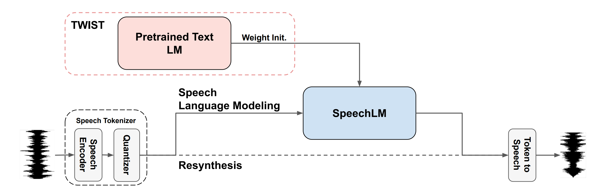

# Textually Pretrained Speech Language Models

This is the official repository of the paper [Textually Pretrained Speech Language Models](https://arxiv.org/abs/2305.13009), audio samples and more information can be found in the [project page](https://pages.cs.huji.ac.il/adiyoss-lab/twist/).


<p align="center">
  
</p>

## Abstract
Speech language models (SpeechLMs) process and generate acoustic data only, without textual supervision. In this work, we propose **TWIST**, a method for training SpeechLMs using a warm-start from a pretrained textual language models. We show using both automatic and human evaluations that TWIST outperforms a cold-start SpeechLM across the board. We empirically analyze the effect of different model design choices such as the speech tokenizer, the pretrained textual model, and the dataset size. We find that model and dataset scale both play an important role in constructing better-performing SpeechLMs. Based on our observations, we present the largest (to the best of our knowledge) SpeechLM both in terms of number of parameters and training data. We additionally introduce two spoken versions of the StoryCloze textual benchmark to further improve model evaluation and advance future research in the field. 

## How to use

First, follow the commands below to configure the enviroment:
```bash
git clone https://github.com/facebookresearch/textlesslib.git
cd textlesslib
pip install -e .
pip install git+https://github.com/pytorch/fairseq
pip install transformers wget
cd examples/twist
```

To run speech continuation with our pretrained models over specific speech prompt use:
```bash
python -m twist_generation --input_file=/path/to/input/file.wav --output_file=/path/to/output/file.wav --twist_model_name=TWIST-1.3B
```
This will generate a continuation for the given speech prompt.

This command will download (once) the relevant HuBERT speech encoder (including its quantizer), a HiFi speech vocoder, and the required pretrained SpeechLM. 

The pretrained SpeechLMs available are: TWIST-350M, TWIST-1.3B and TWIST-7B.


For more information and code examples about the resythesis pipeline see the relevant part in the [Expresso README](https://github.com/facebookresearch/textlesslib/blob/main/examples/expresso/README.md#2-the-baseline-resythesis-model).

## Citation:
```
@misc{hassid2023textually,
                    title={Textually Pretrained Speech Language Models}, 
                    author={Michael Hassid, Tal Remez, Tu Anh Nguyen, Itai Gat, Alexis Conneau, Felix Kreuk, 
                            Jade Copet, Alexandre Defossez, Gabriel Synnaeve, Emmanuel Dupoux, Roy Schwartz, Yossi Adi},
                    year={2023},
                    note = {{arXiv}:2305.13009}
                    url = {https://arxiv.org/abs/2305.13009},
                    }
```